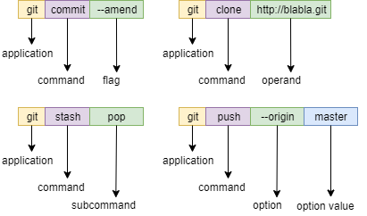

# Argument Terminology

Terminology for arguments is confusing. When should an argument be an option, switch, flag, argument or parameter. Should it be named or positional? Is an option always optional?

Part of the confusion is the overloaded nature of of the term `argument`, as explained in [this article](http://www.informit.com/articles/article.aspx?p=175771). Context determines what is considered an argument. 

TLDR: The terminology of this framework.

## Perspectives

Let's look at the `git stash store` command to see how different perspectives see it. 
Git help describes the usage as `git stash store [-m|--message <message>] [-q|--quiet] <commit>`. 

Let's say we executed this command as follows: `git stash store -q -m 'my stash' e7a8621`

Programmatically, the perspectives are:

* shell: every word is an argument. `git stash store -q -m 'my stash' e7a8621` 
* application: the arguments are `stash store -q -m 'my stash' e7a8621`, as assigned to `Main(string[] args)`
* `stash` command: the arguments are `store`. Once a subcommand is specified, all remaining arguments are for the subcommand.
* `store` command: the arguments are `-q -m 'my stash' e7a8621`.

Conceptually, the perspectives are:

* developer: the arguments are `-q -m 'my stash' e7a8621`.
* user: the arguments are `e7a8621`. `-q` and `-m` are options. Common conventions of help documentation distinguishes options from arguments.

## CommandDotNet Perspectives

1. The user of the console app: needs to understand usage, when arguments are named vs positional.
2. The developer of the console app: needs to define arguments that are named vs positional.
3. The developer of middleware components: often need to operate across all command arguments regardless of type.

### Addressed in the following ways

* For users of the console app
    * help documentation is the interface. 
    * terminoloy: `command`, `option` and `argument`.
* For developers
    * terminoloy: `command`, `argument`, `option` and `operand`
    * types: `Command`, `IArgument`, `Option` and `Operand`.
    * Option and Operand are the two types of IArgument
        * Option: named argument
        * Operand: positional argument
    * Command contains collections of Option, Operand and Command (as subcommands)
    * Arguments are defined using
        * parameters: of a command method
        * properties: of an `IArgumentModel`

Flags are defined as Options with BooleanMode = Implicit.  This is the default for Options of type bool and can be changed using `AppSettings.DefaultBooleanMode` or `OptionAttribute.BooleanMode`.