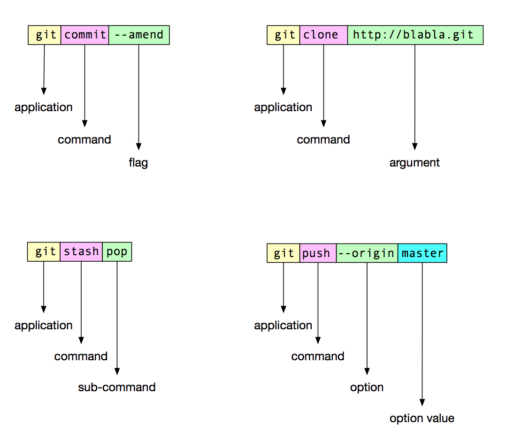

### Arguments

Arguments are simple as we saw already in the [introduction](./index.md). Arguments are the main parameters of the command and should be as less as possible. If you compare them to a english statement, argument is the *Subject* of the sentence. 

Let try an example of an english sentence `Please delete sample.docx file`

Now let's try and remove some extra words we don't need and convert it into command that system can understand. 

Let's say our command name is `delete` and its job is to delete files. We don't need the words `please` and `file`

So we are left with `delete sample.docx`

`delete` here is the name of command and sample.docx is the subject and hence the argument.

C# method for the same would look like

```c#
public void Delete(string fileName)
```

We can have multiple subjects for instance, `please delete sample.docx and number.xls`. That would turn into `delete sample.docx number.xls`

C# method for the same would look like

```c#
public void Delete(List<string> fileNames)
```

### Options

Options are arguments that :
 - Are optional
 - Are named
 - May change behavior of command

For instance let's just go with out example from [arguments](#arguments) section.

This time, the sentence is `please delete the file sample.docx tomorrow`.
In this case, we have extra information about the operation we want to perform i.e. `time`
The command is still `delete`, the subject(argument) is still `sample.docx` but the `time` has changed from `now` to `tomorrow` 

Let's see how we can translate into a cli command

`delete sample.docx --time tomorrow`

C# method for the same would look like

```c#
public void Delete(string fileName, [Option]string time = "Now")
```

### Flags

Flags are very similar to options except for the fact they are aways boolean (& false by default) and don't need an explicit value. If a flag is present, its true, otherwise it's false.

Let's continue with same example as [options](#options),

This time the sentence is `Please delete the file sample.docx safely tomorrow`. 
Safely here means that delete it only if no process is using it. It's naturally translated to a cli command as `delete sample.docs --safely --time=tomorrow`

!!! tip
    Note that `--time tomorrow`, `--time=tomorrow` & `--time:tomorrow` are the same.


Notice that we din't pass any value for `--safely` option. This is flag and it's value will be true since we have passed it.

C# method for the same would look like

```c#
public void Delete(
    string fileName, 
    [Option]bool safely, 
    [Option]string time = "Now")
```